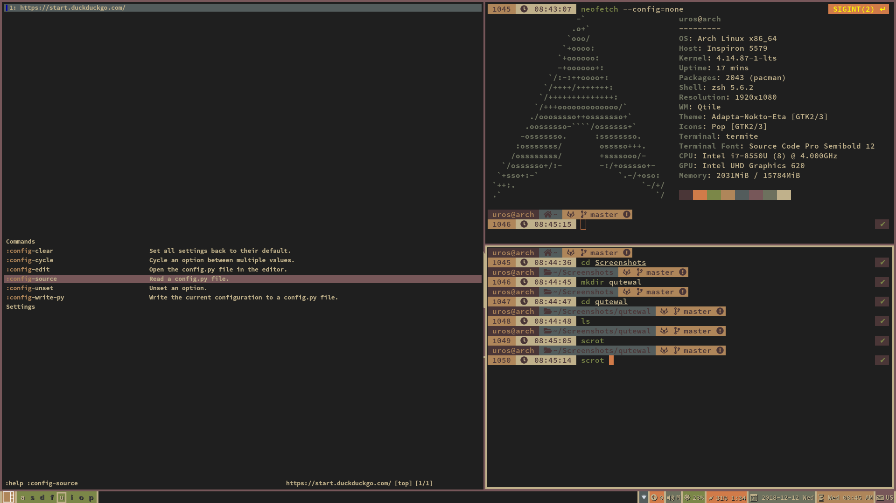
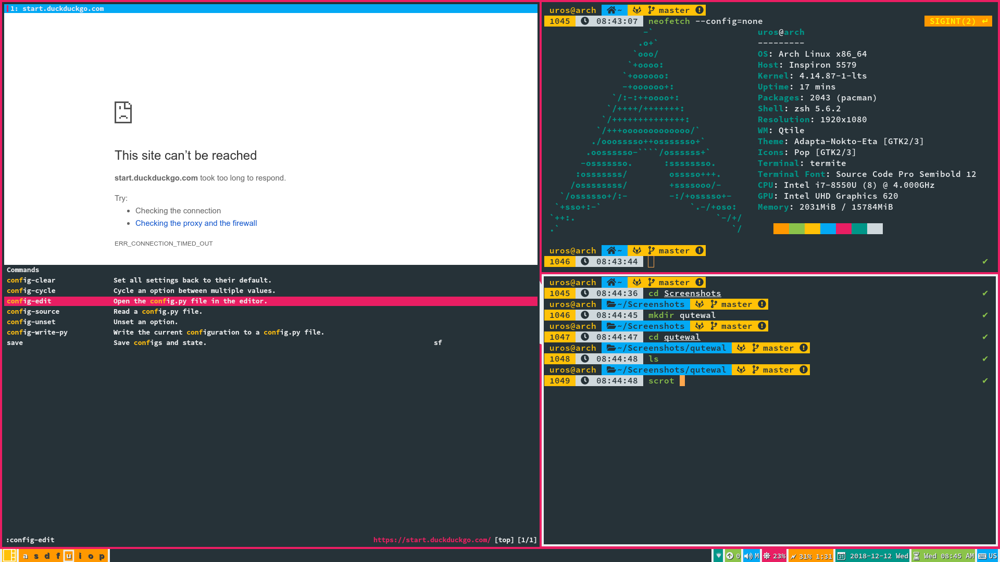
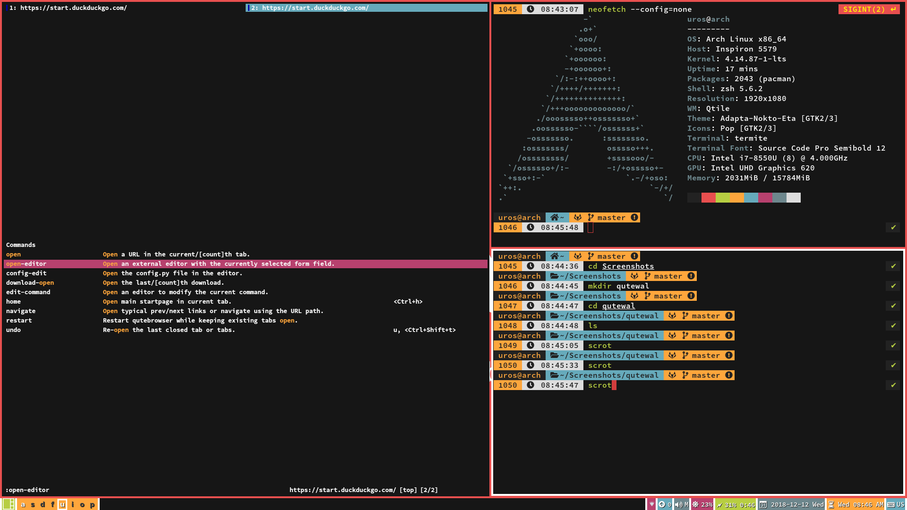
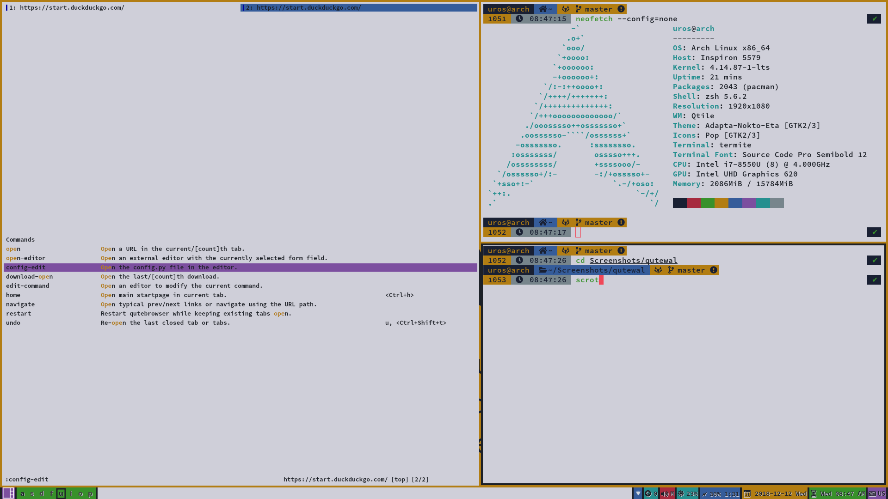
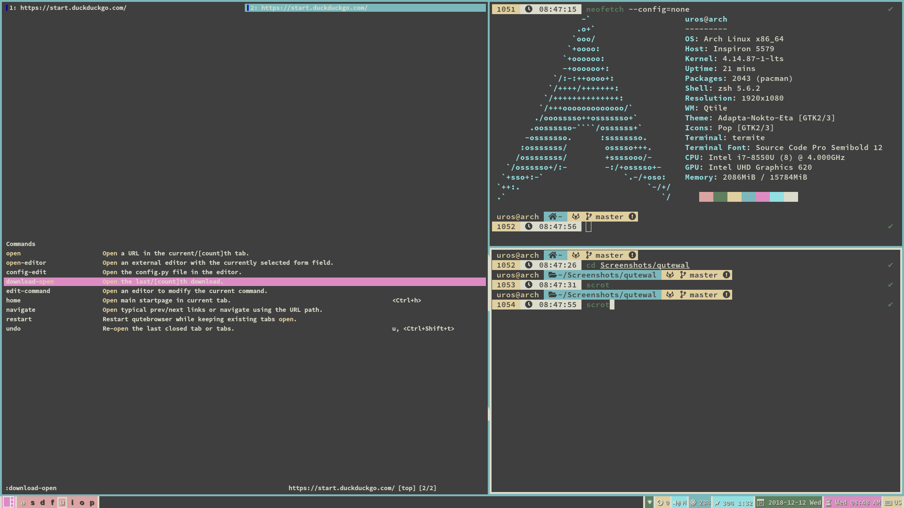

# Wal Qutebrowser Theme

A theme for [Qutebrowser](https://qutebrowser.org) using
[Pywal](https://github.com/dylanaraps/pywal) colorschemes shamelessly ripped off from
[nord-qutebrowser](https://github.com/Linuus/nord-qutebrowser/blob/master/nord-qutebrowser.py).

## Install

1. Clone this repo or copy `qutewal.py`.
2. Symlink (or just copy) the file `qutewal.py` to your `.qutebrowser` directory.
3. Add `config.source('qutewal.py')` at the _end_ of you `config.py` file.

